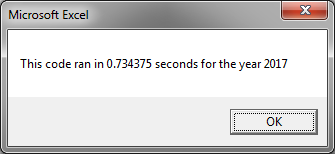
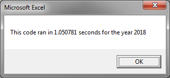
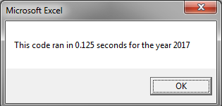
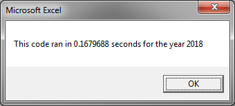

# Module 02 Challenge - Refactoring VBA Code

## Overview of Project

Refactoring of VBA Stock Analysis Code Previously Written

### Purpose

The purpose of this project was to Refactor a set of Visual Basic for Applications (VBA) Excel
Subroutines previously written to perform analysis on a set of trading volume
and price observations to see if they could be made to execute
more quickly.

The initial set of data contained approximately 3,000 observations of one Dozen unique
Stock Ticker Symbols upon which to perform analyses, and did not take
a burdensome amount of computing time to complete using the Original version of the code. However, if the
original subroutine(s) were presented with a hypothetically much
larger set of data to compute, or a larger number of unique Stock Ticker Symbols
to consider, the code in its Original form could
have potentially taken much longer to execute.

The Original code accomplished its task through the use of a two for loop repetition statement structure:

1. An outer for loop to loop through all the specified tickers.
2. An inner for loop to loop through all the rows in the data.

As an exercise, the Original code was Refactored in a manner to
complete all calculations and analyses by looping through the
dataset only one time to completion:

1. One for loop to loop through all the rows in the data.
	- As soon as the Stock Ticker Symbol on the current row is different from the Stock Ticker Ticker Symbol on the next row, the Stock Ticker Symbol Index is advanced and values are computed for the next Stock Ticker Symbol.

In this way, as the dataset gets larger, all other things being equal, compute time would grow
linearly with the size of the data set, rather than quadratically
in the case of the original code version utilizing multiple loop
iterations.

It should be noted here that both versions of the code have a similar limitation regarding the structure of the input data itself:

	- The Original version of the code does not require clusters of Stock Ticker Symbol data to be in the same order as the tickers contained in the `tickers` array, but within each cluster of data itself the Stock Ticker Symbols need to be listed contiguously in chronological order, or the Starting and Ending prices would not be calculated correctly.
	- For the Refactored version of the code to execute properly, it depends both of the clusters of Stock Ticker Symbol data to be listed in the same order as the tickers contained in the `tickers` array, AND within each cluster of data itself the Stock Ticker Symbols need to be listed contiguously in chronological order.

## Results

Upon successful completion of the Refactoring, both versions of the code
were tested for runtime performance for both Year 2017 and Year 2018.

The initial results of these tests are summarized below in

Table 1: [Seconds, rounded to 4 decimal places]
|          |2017    |2018     |
|----------|--------|---------|
|Original  |0.7344  |1.0508   |
|Refactored|0.1250  |0.1680   |

Even on a small dataset comprising observations for 12 unique values over
approximately 3,000 rows, it can readily be seen that the Refactored code performs
about 6 times faster than the Original code. On larger datasets, one
can imagine that this could quickly add up to much more significant
runtimes in actual use.

To dive in a little deeper, and to take out the variables of different processors, operating systems, and at-the-moment available system resources (phases of the moon, solar flare activity??), the code execution of each version was re-checked simply for total number of iterations to accomplish its task.

The results of these tests are summarized below in

Table 2: Number of Iterations
|          |2017    |2018     |
|----------|--------|---------|
|Original  |36,144  |36,144   |
|Refactored|3,012   |3,012    |

As we might expect, the number of iterations for the Original code corresponds to the number of tickers multiplied by the number of data-containing rows, while the number of iterations for the Refactored code corresponds simply to the number of data-containing rows.

Since no matter how large the dataset grows,
the Refactored code only runs the loop one time, the runtime will grow
linearly according to the size of the dataset; however, the Original code
adds an additional loop iteration for each new unique value under consideration and for each new row in the dataset, and thus the runtime will increase both according to the size of the dataset 
and the number of Stock Ticker Symbol values that are taken into account.

## Summary

### Advantages of Refactoring Code

In this case, a definite advantage of Refactoring the code
is the resulting increase in runtime efficiency.

### Disadvantages of Refactoring Code

A disadvantage of the Refactored code is in usage of available
memory. The Original code uses only one Array to contain the
Stock Ticker Symbols, and the calculated results are output
once all the rows have been looped through for each iteration.
In this case, 12 strings are held in memory.

In contrast, the Refactored code uses 4 Arrays, 3 of which are
used to temporarily store the calculated results until all the rows
have been looped through. Then the Arrays themselves are looped
through to output the results. Rather than holding only 12 strings in memory,
this time, 12 strings, 12 longs, and 24 doubles are held in memory.

If the number of Stock Ticker Symbol values under consideration started to grow into the
thousands, even the Refactored code could start to execute with less-than-satisfactory performance.

## Additional Resources

### Code Execution Message Box Screenshots

For reference, Screenshots of Code Execution Message Boxes are Reproduced Here (Also available within `./Resources`):

Figure 1: Code Version 1 (2017):

Figure 2: Code Version 1 (2018):

Figure 3: Refactored Code (2017):

Figure 4: Refactored Code (2018):

